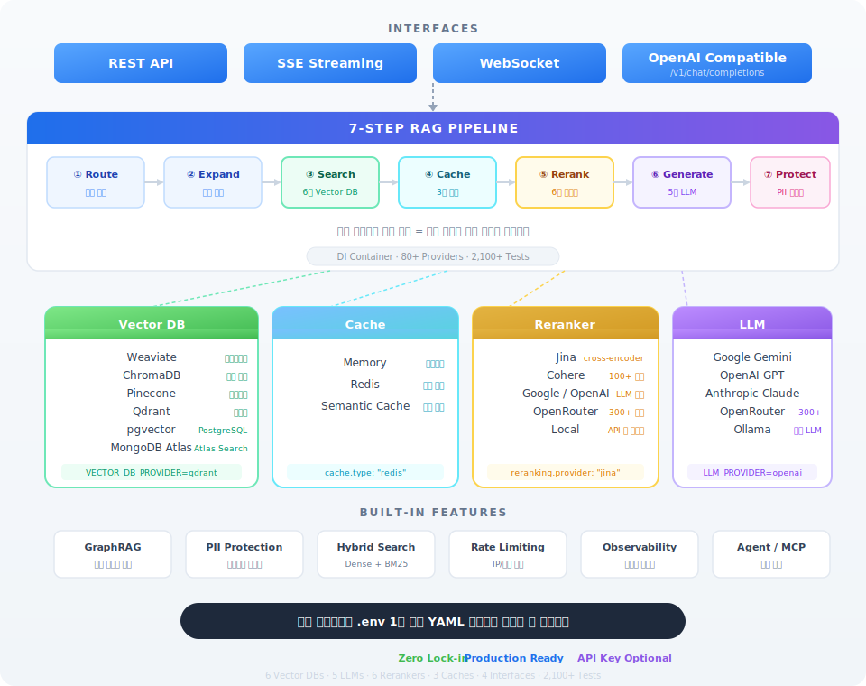

<p align="center">
  
</p>

<p align="center">
  <strong>Start in 5 minutes, swap components with 1 line of config — Production-ready RAG Backend</strong>
</p>

<p align="center">
  <a href="https://github.com/youngouk/OneRAG/actions/workflows/ci.yml"></a>
  <a href="https://opensource.org/licenses/MIT"></a>
  <a href="https://www.python.org/downloads/"></a>
  <a href="https://github.com/youngouk/OneRAG/stargazers"></a>
</p>

<p align="center">
  <a href="README.md">한국어</a> | <strong>English</strong>
</p>

---

## TL;DR

```bash
git clone https://github.com/youngouk/OneRAG.git && cd OneRAG && uv sync
```

```bash
# 🐳 Have Docker → Full API Server (Weaviate + FastAPI + Swagger UI)
cp quickstart/.env.quickstart .env   # Set only GOOGLE_API_KEY
make start                            # → http://localhost:8000/docs

# 💻 No Docker → Local CLI Chatbot (runs instantly)
make easy-start                       # → Chat directly in terminal

# 🔒 No API Key → Fully offline with Ollama local LLM
ollama pull llama3.2 && make easy-start
```

---

## Why OneRAG?

**Assemble every RAG component from a single codebase.**

- **Swap with 1 line** — Vector DB, LLM, Reranker, Cache — all changeable via `.env` or YAML
- **Start without API keys** — Fully functional offline with Ollama local LLM
- **OpenAI SDK compatible** — Connect existing OpenAI code directly to OneRAG (`/v1/chat/completions`)
- **2,100+ tests** — Production-verified stability with full CI/CD
- **PoC to Production** — Scale with the same codebase, no rebuilding needed

### Architecture at a Glance

<p align="center">
  
</p>

---

## Getting Started

|  | Full API Server (`make start`) | CLI Chatbot (`make easy-start`) |
|---|---|---|
| **Docker** | Required | Not required |
| **Vector DB** | Weaviate (hybrid search) | ChromaDB (local file) |
| **Interface** | REST API + Swagger UI | Terminal CLI |
| **LLM** | 5 providers (Gemini, OpenAI, Claude, OpenRouter, Ollama) | Gemini / OpenRouter / Ollama |
| **Use case** | Production, API integration, team dev | Learning, exploration, quick PoC |

### Option A: Full API Server (Docker)

```bash
git clone https://github.com/youngouk/OneRAG.git
cd OneRAG && uv sync

cp quickstart/.env.quickstart .env
# Set GOOGLE_API_KEY in .env file
# (Free: https://aistudio.google.com/apikey)

make start
```

**Done!** Test immediately at [http://localhost:8000/docs](http://localhost:8000/docs)

```bash
make start-down  # Stop
```

### Option B: Local CLI Chatbot (No Docker)

Experience RAG search + AI answers directly in your terminal without Docker.

```bash
git clone https://github.com/youngouk/OneRAG.git
cd OneRAG && uv sync

make easy-start
```

25 sample documents are auto-loaded with hybrid search (Dense + BM25) ready to go.
To enable AI answer generation, set one API key:

```bash
# Set just one of these
export GOOGLE_API_KEY="your-key"       # Free: https://aistudio.google.com/apikey
export OPENROUTER_API_KEY="your-key"   # https://openrouter.ai/keys
ollama pull llama3.2                    # Use local LLM without API key
```

> **New to OneRAG?** Start with `make easy-start` and ask the chatbot directly.
> "What is hybrid search?", "How does the RAG pipeline work?" — the sample data has the answers.

---

## OpenAI Compatible API

Connect existing OpenAI SDK code to OneRAG without any modifications.

```python
from openai import OpenAI

client = OpenAI(base_url="http://localhost:8000/v1", api_key="not-needed")

# RAG search + AI answer generation
response = client.chat.completions.create(
    model="gemini",  # or ollama/llama3.2, openrouter/google/gemini-2.0-flash
    messages=[{"role": "user", "content": "What is RAG?"}],
)
print(response.choices[0].message.content)
```

**Supported Endpoints:**
- `POST /v1/chat/completions` — Chat completions (streaming supported)
- `GET /v1/models` — List available models

**Model Selection:**
| Format | Example | Description |
|--------|---------|-------------|
| `provider` | `gemini`, `ollama`, `claude` | Use default model |
| `provider/model` | `ollama/qwen2.5:3b` | Specify exact model |
| `openrouter/vendor/model` | `openrouter/google/gemini-2.0-flash` | Via OpenRouter |

Works with any tool that uses the OpenAI SDK — LangChain, Cursor, Open WebUI, and more.

---

## Swapping Components

### Change Vector DB (1 line)

```bash
# Change just one line in .env
VECTOR_DB_PROVIDER=weaviate  # or chroma, pinecone, qdrant, pgvector, mongodb
```

### Change LLM (1 line)

```bash
# Change just one line in .env
LLM_PROVIDER=google  # or openai, anthropic, openrouter, ollama
```

### Add Reranker (2 lines YAML)

```yaml
# app/config/features/reranking.yaml
reranking:
  approach: "cross-encoder"  # or late-interaction, llm, local
  provider: "jina"           # or cohere, google, openai, openrouter, sentence-transformers
```

### Toggle Features On/Off (YAML config)

```yaml
# Enable caching
cache:
  enabled: true
  type: "redis"  # or memory, semantic

# Enable GraphRAG
graph_rag:
  enabled: true

# Enable PII masking
pii:
  enabled: true
```

---

## Building Blocks

| Category | Options | How to Change |
|----------|---------|---------------|
| **Vector DB** | Weaviate, Chroma, Pinecone, Qdrant, pgvector, MongoDB | 1 env var |
| **LLM** | Google Gemini, OpenAI, Anthropic Claude, OpenRouter, Ollama | 1 env var |
| **Reranker** | Jina, Cohere, Google, OpenAI, OpenRouter, Local | 2 lines YAML |
| **Cache** | Memory, Redis, Semantic | 1 line YAML |
| **Query Routing** | LLM-based, Rule-based | 1 line YAML |
| **Korean Search** | Synonyms, stopwords, user dictionary | YAML config |
| **Security** | PII detection, masking, audit logging | YAML config |
| **GraphRAG** | Knowledge graph-based relation reasoning | 1 line YAML |
| **Agent** | Tool execution, MCP protocol | YAML config |

---

## RAG Pipeline

```
Query → Router → Expansion → Retriever → Cache → Reranker → Generator → PII Masking → Response
```

| Stage | Function | Swappable |
|-------|----------|-----------|
| Query Routing | Classify query type | LLM/Rule selection |
| Query Expansion | Synonyms, stopwords | Custom dictionary |
| Retrieval | Vector/hybrid search | 6 DBs |
| Caching | Response cache | 3 cache types |
| Reranking | Sort search results | 6 rerankers |
| Generation | LLM response | 5 LLMs |
| Post-processing | PII masking | Custom policies |

---

## Configuration Guide by Stage

| Stage | Components | Use Case |
|-------|------------|----------|
| **Basic** | Vector search + LLM | Simple document Q&A |
| **Standard** | + Hybrid search + Reranker | Services requiring search quality **(Recommended)** |
| **Advanced** | + GraphRAG + Agent | Complex relation reasoning, tool execution |

> Start with Basic, add blocks as needed.

---

## Frontend UI

A full-featured React web UI is included. Run it alongside the backend API server to experience the complete RAG system in your browser.

**Key Features:**
- WebSocket real-time streaming chat (RAG search results + AI answers)
- Drag-and-drop document upload (PDF, Word, Excel, Markdown, etc.)
- Document management — search, sort, bulk delete, detail view
- Dark mode, mobile-responsive layout
- Feature flag-based module activation/deactivation

```bash
# With the backend running
make frontend-dev    # → http://localhost:5173
```

> Run frontend + backend + Weaviate together: `make start-full`

---

## Multilingual Support

The easy-start CLI chatbot supports 4 languages.

```bash
make easy-start LANG=en    # English
make easy-start LANG=ja    # 日本語
make easy-start LANG=zh    # 中文
make easy-start            # 한국어 (default)
```

UI text, system prompts, and sample data are fully localized for each language.

---

## Development

```bash
make dev-reload   # Dev server (auto-reload)
make test         # Run tests (2,100+)
make lint         # Lint check
make type-check   # Type check
```

---

## Documentation

- [Detailed Setup Guide](docs/SETUP.md)
- [Architecture Overview](docs/ARCHITECTURE.md)
- [Streaming API Guide](docs/streaming-api-guide.md)
- [WebSocket API Guide](docs/websocket-api-guide.md)

---

## License

MIT License

---

<p align="center">
  <sub>This project was created by a RAG Chat Service PM who wanted to implement features accumulated across multiple projects.<br>
  Designed so that beginners can easily run PoCs and scale to production.</sub>
</p>

<p align="center">
  <a href="https://github.com/youngouk/OneRAG/issues">Report Bug</a> ·
  <a href="https://github.com/youngouk/OneRAG/issues">Request Feature</a> ·
  <a href="https://github.com/youngouk/OneRAG/discussions">Discussions</a>
</p>
