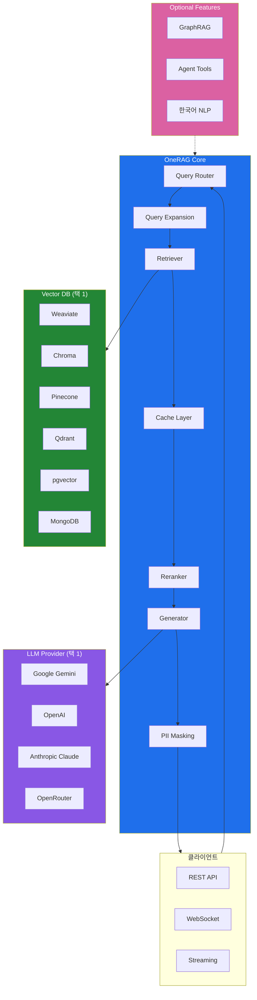
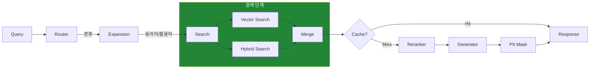
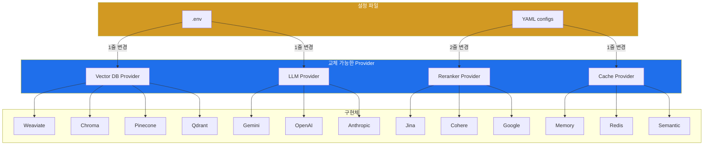
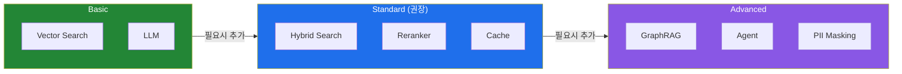
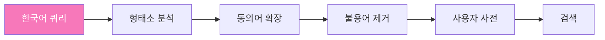

# OneRAG Architecture Diagrams

아래 다이어그램들을 README나 docs에 포함할 수 있습니다. GitHub에서 Mermaid를 자동으로 렌더링합니다.

---

## 1. 전체 시스템 아키텍처

---

## 2. RAG 파이프라인 상세

---

## 3. 컴포넌트 교체 가능 구조

---

## 4. 단계별 확장 가이드

---

## 5. 한국어 처리 파이프라인 (Optional)

