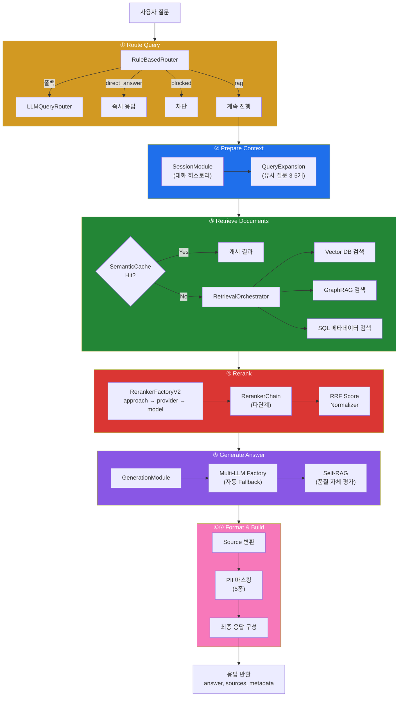
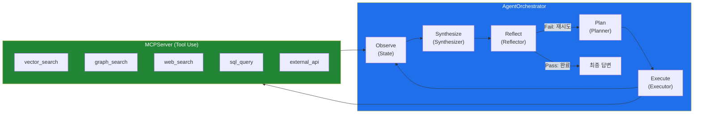
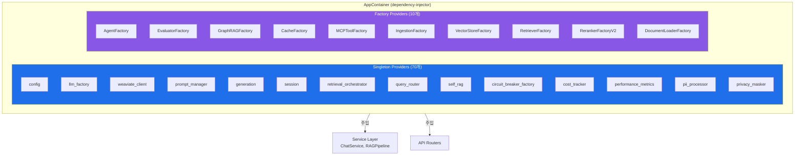
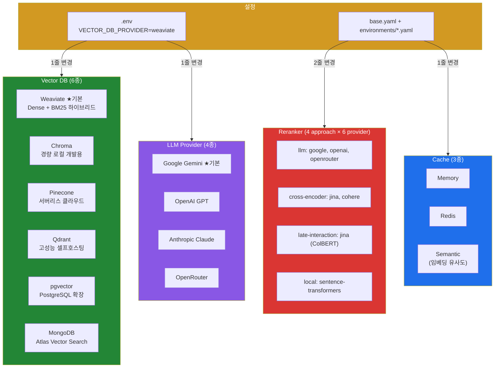
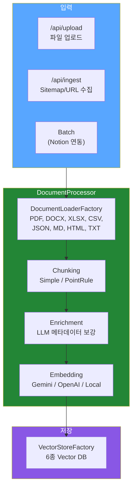
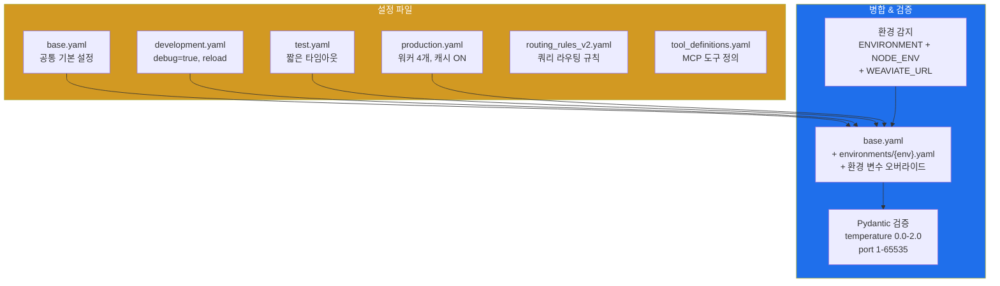
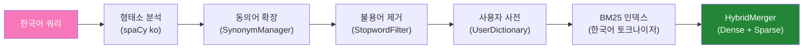

# OneRAG 시스템 아키텍처 (v1.0.7)

GitHub에서 Mermaid를 자동으로 렌더링합니다.

---

## 1. 전체 시스템 아키텍처


```mermaid
flowchart TB
    subgraph Client["클라이언트"]
        REST["REST API<br/>/chat, /api/*"]
        SSE["SSE Streaming<br/>/chat/stream"]
        WS["WebSocket<br/>/chat-ws"]
        FE["React Frontend<br/>:5000"]
    end

    subgraph Middleware["미들웨어 계층"]
        CORS[CORS]
        GZIP[GZip]
        RL["Rate Limiter<br/>IP 30/분, Session 10/분"]
        AUTH["Auth<br/>X-API-Key"]
        ERRLOG["Error Logger"]
    end

    subgraph API["API Routers (15+)"]
        CHAT["/chat"]
        STREAM["/chat/stream"]
        WSRT["/chat-ws"]
        ADMIN["/api/admin/*"]
        DOCS["/api/documents"]
        UPLOAD["/api/upload"]
        EVAL["/api/evaluations"]
        INGEST["/api/ingest"]
        HEALTH["/api/health"]
        MON["/api/monitoring"]
    end

    subgraph Service["Service Layer"]
        CS["ChatService"]
        RAG["RAGPipeline<br/>(7단계 오케스트레이터)"]
    end

    subgraph DI["DI Container<br/>80+ Providers"]
        SING["Singleton 70개"]
        FACT["Factory 10개"]
    end

    Client --> Middleware
    Middleware --> API
    API --> Service
    Service --> DI

    style Client fill:#58a6ff,color:#fff
    style Middleware fill:#d29922,color:#fff
    style API fill:#3fb950,color:#fff
    style Service fill:#1f6feb,color:#fff
    style DI fill:#8957e5,color:#fff
```

---

## 2. RAG 파이프라인 상세 (7단계)


```mermaid
flowchart TB
    Q["사용자 질문"] --> S1

    subgraph S1["① Route Query"]
        RBR["RuleBasedRouter"] -->|"폴백"| LQR["LLMQueryRouter"]
        RBR -->|"direct_answer"| IMM["즉시 응답"]
        RBR -->|"blocked"| BLK["차단"]
        RBR -->|"rag"| CONT["계속 진행"]
    end

    CONT --> S2

    subgraph S2["② Prepare Context"]
        SESS["SessionModule<br/>(대화 히스토리)"]
        QE["QueryExpansion<br/>(유사 질문 3-5개)"]
        SESS --> QE
    end

    S2 --> S3

    subgraph S3["③ Retrieve Documents"]
        SC{"SemanticCache<br/>Hit?"}
        SC -->|"Yes"| CACHED["캐시 결과"]
        SC -->|"No"| RO["RetrievalOrchestrator"]

        RO --> VDB["Vector DB 검색"]
        RO --> GR["GraphRAG 검색"]
        RO --> SQL["SQL 메타데이터 검색"]
    end

    S3 --> S4

    subgraph S4["④ Rerank"]
        RF["RerankerFactoryV2<br/>approach → provider → model"]
        RC["RerankerChain<br/>(다단계)"]
        RRF["RRF Score<br/>Normalizer"]
        RF --> RC --> RRF
    end

    S4 --> S5

    subgraph S5["⑤ Generate Answer"]
        GEN["GenerationModule"]
        LLM["Multi-LLM Factory<br/>(자동 Fallback)"]
        SRAG["Self-RAG<br/>(품질 자체 평가)"]
        GEN --> LLM --> SRAG
    end

    S5 --> S6

    subgraph S6["⑥⑦ Format & Build"]
        FMT["Source 변환"]
        PII["PII 마스킹<br/>(5종)"]
        BUILD["최종 응답 구성"]
        FMT --> PII --> BUILD
    end

    BUILD --> RES["응답 반환<br/>answer, sources, metadata"]

    style S1 fill:#d29922,color:#fff
    style S2 fill:#1f6feb,color:#fff
    style S3 fill:#238636,color:#fff
    style S4 fill:#da3633,color:#fff
    style S5 fill:#8957e5,color:#fff
    style S6 fill:#f778ba,color:#fff
```

---

## 3. Agentic RAG (ReAct 패턴)


```mermaid
flowchart LR
    subgraph Agent["AgentOrchestrator"]
        PLAN["Plan<br/>(Planner)"]
        EXEC["Execute<br/>(Executor)"]
        OBS["Observe<br/>(State)"]
        SYN["Synthesize<br/>(Synthesizer)"]
        REF["Reflect<br/>(Reflector)"]

        PLAN --> EXEC --> OBS --> SYN --> REF
        REF -->|"Fail: 재시도"| PLAN
        REF -->|"Pass: 완료"| DONE["최종 답변"]
    end

    subgraph Tools["MCPServer (Tool Use)"]
        T1["vector_search"]
        T2["graph_search"]
        T3["web_search"]
        T4["sql_query"]
        T5["external_api"]
    end

    EXEC --> Tools
    Tools --> OBS

    style Agent fill:#1f6feb,color:#fff
    style Tools fill:#238636,color:#fff
```

---

## 4. DI 컨테이너 구조


```mermaid
graph TB
    subgraph Container["AppContainer (dependency-injector)"]
        subgraph Singletons["Singleton Providers (70개)"]
            CFG["config"]
            LLM["llm_factory"]
            WC["weaviate_client"]
            PM["prompt_manager"]
            GEN["generation"]
            SESS["session"]
            RO["retrieval_orchestrator"]
            QR["query_router"]
            SR["self_rag"]
            CB["circuit_breaker_factory"]
            CT["cost_tracker"]
            PERF["performance_metrics"]
            PIIP["pii_processor"]
            MASK["privacy_masker"]
        end

        subgraph Factories["Factory Providers (10개)"]
            F1["AgentFactory"]
            F2["EvaluatorFactory"]
            F3["GraphRAGFactory"]
            F4["CacheFactory"]
            F5["MCPToolFactory"]
            F6["IngestionFactory"]
            F7["VectorStoreFactory"]
            F8["RetrieverFactory"]
            F9["RerankerFactoryV2"]
            F10["DocumentLoaderFactory"]
        end
    end

    Container -->|"주입"| SVC["Service Layer<br/>ChatService, RAGPipeline"]
    Container -->|"주입"| RTR["API Routers"]

    style Singletons fill:#1f6feb,color:#fff
    style Factories fill:#8957e5,color:#fff
```

---

## 5. 교체 가능 컴포넌트 (Provider 패턴)


```mermaid
graph TB
    subgraph Config["설정"]
        ENV[".env<br/>VECTOR_DB_PROVIDER=weaviate"]
        YAML["base.yaml + environments/*.yaml"]
    end

    subgraph VDB["Vector DB (6종)"]
        W["Weaviate ★기본<br/>Dense + BM25 하이브리드"]
        CH["Chroma<br/>경량 로컬 개발용"]
        PI["Pinecone<br/>서버리스 클라우드"]
        QD["Qdrant<br/>고성능 셀프호스팅"]
        PG["pgvector<br/>PostgreSQL 확장"]
        MO["MongoDB<br/>Atlas Vector Search"]
    end

    subgraph LLMP["LLM Provider (4종)"]
        GE["Google Gemini ★기본"]
        OA["OpenAI GPT"]
        AN["Anthropic Claude"]
        OR["OpenRouter"]
    end

    subgraph RRP["Reranker (4 approach × 6 provider)"]
        direction LR
        R_LLM["llm: google, openai, openrouter"]
        R_CE["cross-encoder: jina, cohere"]
        R_LI["late-interaction: jina (ColBERT)"]
        R_LO["local: sentence-transformers"]
    end

    subgraph CP["Cache (3종)"]
        ME["Memory"]
        RE["Redis"]
        SE["Semantic<br/>(임베딩 유사도)"]
    end

    ENV -->|"1줄 변경"| VDB
    ENV -->|"1줄 변경"| LLMP
    YAML -->|"2줄 변경"| RRP
    YAML -->|"1줄 변경"| CP

    style Config fill:#d29922,color:#fff
    style VDB fill:#238636,color:#fff
    style LLMP fill:#8957e5,color:#fff
    style RRP fill:#da3633,color:#fff
    style CP fill:#1f6feb,color:#fff
```

---

## 6. 보안 계층


```mermaid
flowchart LR
    subgraph Auth["인증"]
        AK["X-API-Key<br/>Admin, Evaluations"]
        TD["secrets.compare_digest<br/>(타이밍 공격 방어)"]
    end

    subgraph PII["PII 보호 (5종)"]
        P1["주민번호 (SSN)"]
        P2["전화번호"]
        P3["이메일"]
        P4["여권번호"]
        P5["운전면허번호"]
        PR["PIIReviewProcessor<br/>(AI 리뷰)"]
        PA["PIIAuditLogger<br/>(감사 로그)"]
    end

    subgraph Defense["방어"]
        PS["PromptSanitizer<br/>(Injection 방어)"]
        CORS2["CORS<br/>(명시적 헤더)"]
        RLM["RateLimiter<br/>IP 30/분"]
        SQLD["SQL Injection<br/>(화이트리스트)"]
    end

    subgraph Observe["관측성"]
        CT2["CostTracker<br/>LLM 비용 추적"]
        PM2["PerformanceMetrics<br/>캐시 히트율, 지연시간"]
        CB2["CircuitBreaker<br/>장애 전파 차단"]
        LF["Langfuse/LangSmith<br/>트레이싱"]
        RM["/api/admin/<br/>realtime-metrics"]
    end

    Auth ~~~ PII ~~~ Defense ~~~ Observe

    style Auth fill:#da3633,color:#fff
    style PII fill:#f778ba,color:#fff
    style Defense fill:#d29922,color:#fff
    style Observe fill:#1f6feb,color:#fff
```

---

## 7. 문서 수집 파이프라인 (Ingestion)


```mermaid
flowchart TB
    subgraph Input["입력"]
        UP["/api/upload<br/>파일 업로드"]
        IG["/api/ingest<br/>Sitemap/URL 수집"]
        BA["Batch<br/>(Notion 연동)"]
    end

    subgraph Process["DocumentProcessor"]
        LD["DocumentLoaderFactory<br/>PDF, DOCX, XLSX, CSV,<br/>JSON, MD, HTML, TXT"]
        CK["Chunking<br/>Simple / PointRule"]
        EN["Enrichment<br/>LLM 메타데이터 보강"]
        EM["Embedding<br/>Gemini / OpenAI / Local"]
    end

    subgraph Store["저장"]
        VS["VectorStoreFactory<br/>6종 Vector DB"]
    end

    Input --> LD --> CK --> EN --> EM --> VS

    style Input fill:#58a6ff,color:#fff
    style Process fill:#238636,color:#fff
    style Store fill:#8957e5,color:#fff
```

---

## 8. 설정 관리 & 환경 구조


```mermaid
flowchart TB
    subgraph Files["설정 파일"]
        BASE["base.yaml<br/>공통 기본 설정"]
        DEV["development.yaml<br/>debug=true, reload"]
        TEST["test.yaml<br/>짧은 타임아웃"]
        PROD["production.yaml<br/>워커 4개, 캐시 ON"]
        ROUTE["routing_rules_v2.yaml<br/>쿼리 라우팅 규칙"]
        TOOLS["tool_definitions.yaml<br/>MCP 도구 정의"]
    end

    subgraph Merge["병합 & 검증"]
        DETECT["환경 감지<br/>ENVIRONMENT + NODE_ENV<br/>+ WEAVIATE_URL"]
        MRG["base.yaml<br/>+ environments/{env}.yaml<br/>+ 환경 변수 오버라이드"]
        VAL["Pydantic 검증<br/>temperature 0.0-2.0<br/>port 1-65535"]
    end

    BASE --> MRG
    DEV --> MRG
    TEST --> MRG
    PROD --> MRG
    DETECT --> MRG --> VAL

    style Files fill:#d29922,color:#fff
    style Merge fill:#1f6feb,color:#fff
```

---

## 9. 한국어 처리 파이프라인


```mermaid
flowchart LR
    Q["한국어 쿼리"] --> T["형태소 분석<br/>(spaCy ko)"]
    T --> SY["동의어 확장<br/>(SynonymManager)"]
    SY --> SW["불용어 제거<br/>(StopwordFilter)"]
    SW --> UD["사용자 사전<br/>(UserDictionary)"]
    UD --> BM["BM25 인덱스<br/>(한국어 토크나이저)"]
    BM --> HM["HybridMerger<br/>(Dense + Sparse)"]

    style Q fill:#f778ba,color:#fff
    style HM fill:#238636,color:#fff
```

---

## 10. 사용 난이도 가이드

OneRAG는 사용자의 기술 수준과 목적에 따라 3단계로 나누어 접근할 수 있습니다.

### 난이도 개요


```mermaid
graph LR
    subgraph L1["Level 1: 입문<br/>⭐"]
        L1A["CLI 챗봇 실행"]
        L1B["샘플 데이터 대화"]
        L1C["API Key 1개만 설정"]
    end

    subgraph L2["Level 2: 활용<br/>⭐⭐⭐"]
        L2A["Docker 서버 운영"]
        L2B["Vector DB 교체"]
        L2C["LLM Provider 변경"]
        L2D["문서 업로드/관리"]
    end

    subgraph L3["Level 3: 확장<br/>⭐⭐⭐⭐⭐"]
        L3A["커스텀 Reranker 조합"]
        L3B["Agent Tool 추가"]
        L3C["GraphRAG 구축"]
        L3D["프로덕션 배포"]
    end

    L1 -->|"익숙해지면"| L2 -->|"필요할 때"| L3

    style L1 fill:#238636,color:#fff
    style L2 fill:#1f6feb,color:#fff
    style L3 fill:#8957e5,color:#fff
```

### Level 1: 입문 (Docker 불필요, 5분)

| 항목 | 내용 |
|------|------|
| **대상** | RAG를 처음 접하는 개발자, 빠르게 체험하고 싶은 사용자 |
| **필요 지식** | Python 기초, 터미널 사용법 |
| **필요 설정** | API Key 1개 (`GOOGLE_API_KEY` 또는 `OPENROUTER_API_KEY`) |
| **실행 방법** | `git clone` → `uv sync` → `make easy-start` |
| **사용하는 것** | ChromaDB (로컬 파일), CLI 챗봇 인터페이스 |
| **할 수 있는 것** | 샘플 데이터 기반 질의응답, RAG 동작 원리 체험 |

**이 단계에서 신경 쓸 필요 없는 것:**
- Docker, Weaviate, PostgreSQL 등 외부 서비스
- 환경별 설정 파일 (YAML)
- 인증, 보안, PII 마스킹
- Reranker, GraphRAG, Agent

### Level 2: 활용 (Docker 필요, 30분)

| 항목 | 내용 |
|------|------|
| **대상** | 팀 프로젝트에 RAG를 통합하려는 백엔드 개발자 |
| **필요 지식** | Docker Compose, REST API, 환경 변수 관리 |
| **필요 설정** | `.env` 파일 (LLM Key + Vector DB 설정) |
| **실행 방법** | `cp quickstart/.env.quickstart .env` → `make start` |
| **사용하는 것** | Weaviate (하이브리드 검색), FastAPI 서버, Swagger UI |

**이 단계에서 다루는 것:**

| 작업 | 난이도 | 방법 |
|------|--------|------|
| Vector DB 교체 | 쉬움 | `.env`에서 `VECTOR_DB_PROVIDER=chroma` 1줄 변경 |
| LLM 변경 | 쉬움 | `.env`에서 API Key 교체 (자동 감지) |
| 문서 업로드 | 쉬움 | `/api/upload` 엔드포인트 또는 Swagger UI |
| Reranker 변경 | 보통 | `base.yaml`에서 approach/provider 2줄 변경 |
| 캐시 전략 변경 | 보통 | `base.yaml`에서 cache 섹션 수정 |
| Streaming 연동 | 보통 | `/chat/stream` SSE 엔드포인트 호출 |
| WebSocket 연동 | 보통 | `/chat-ws` WebSocket 프로토콜 구현 |

### Level 3: 확장 (프로덕션 운영, 수일~수주)

| 항목 | 내용 |
|------|------|
| **대상** | 프로덕션 배포, 커스텀 기능 개발이 필요한 시니어 개발자 |
| **필요 지식** | DI 패턴, Protocol 인터페이스, asyncio, Factory 패턴 |
| **핵심 파일** | `di_container.py`, `rag_pipeline.py`, `orchestrator.py` |

**이 단계에서 다루는 것:**

| 작업 | 난이도 | 핵심 포인트 |
|------|--------|-------------|
| 커스텀 Reranker 추가 | 높음 | `RerankerFactoryV2`에 등록, Protocol 인터페이스 구현 |
| 새 Vector DB 추가 | 높음 | `VectorStoreFactory` + `RetrieverFactory`에 등록 |
| Agent Tool 개발 | 높음 | `MCPToolFactory`에 등록, `interfaces.py` Protocol 준수 |
| GraphRAG 구축 | 높음 | `GraphRAGFactory` 사용, Neo4j 또는 NetworkX 선택 |
| Self-RAG 튜닝 | 높음 | `LLMQualityEvaluator` 임계값 조정 |
| 프로덕션 보안 설정 | 높음 | CORS, Rate Limit, PII 마스킹, 환경 감지 로직 이해 |
| 환경별 배포 | 높음 | `production.yaml` 커스터마이징, CI/CD 파이프라인 |
| 새 LLM Provider 추가 | 보통 | `LLMClientFactory`에 등록 |

### 난이도별 핵심 파일 맵

```
Level 1 (입문)
├── easy_start/run.py              ← 원클릭 실행
├── easy_start/chat.py             ← CLI 챗봇
└── .env                           ← API Key 설정

Level 2 (활용)
├── main.py                        ← FastAPI 앱 진입점
├── app/config/base.yaml           ← 공통 설정
├── app/config/environments/       ← 환경별 설정
├── quickstart/.env.quickstart     ← 설정 템플릿
├── docker-compose.yml             ← 서비스 구성
└── docs/streaming-api-guide.md    ← API 가이드

Level 3 (확장)
├── app/core/di_container.py       ← DI 컨테이너 (80+ Providers)
├── app/api/services/rag_pipeline.py ← 7단계 RAG 파이프라인
├── app/modules/core/              ← 핵심 모듈 (15+ 도메인)
│   ├── agent/orchestrator.py      ← ReAct Agent 루프
│   ├── retrieval/orchestrator.py  ← 검색 오케스트레이터
│   ├── retrieval/rerankers/       ← 리랭커 (6 provider)
│   ├── generation/generator.py    ← 답변 생성
│   ├── privacy/masker.py          ← PII 마스킹
│   └── graph/                     ← GraphRAG
└── app/infrastructure/            ← 스토리지, DB 연결
```

---

## 11. 프로젝트 수치 요약

| 항목 | 수치 |
|------|------|
| **소스 코드** | 260+ Python 파일 |
| **테스트** | 1,943개 통과 / 0 실패 |
| **DI Provider** | 80+ (Singleton 70 + Factory 10) |
| **API 엔드포인트** | 15+ 라우터 (REST + SSE + WebSocket) |
| **Vector DB** | 6종 (Weaviate, Chroma, Pinecone, Qdrant, pgvector, MongoDB) |
| **LLM Provider** | 4종 (Gemini, OpenAI, Claude, OpenRouter) |
| **Reranker** | 4 approach x 6 provider |
| **파일 로더** | 8종 (PDF, DOCX, XLSX, CSV, JSON, MD, HTML, TXT) |
| **PII 패턴** | 5종 (SSN, 전화번호, 이메일, 여권번호, 운전면허번호) |
| **에러 시스템** | 양언어 (한/영) 자동 전환 |
| **완성도** | 100/100 |
