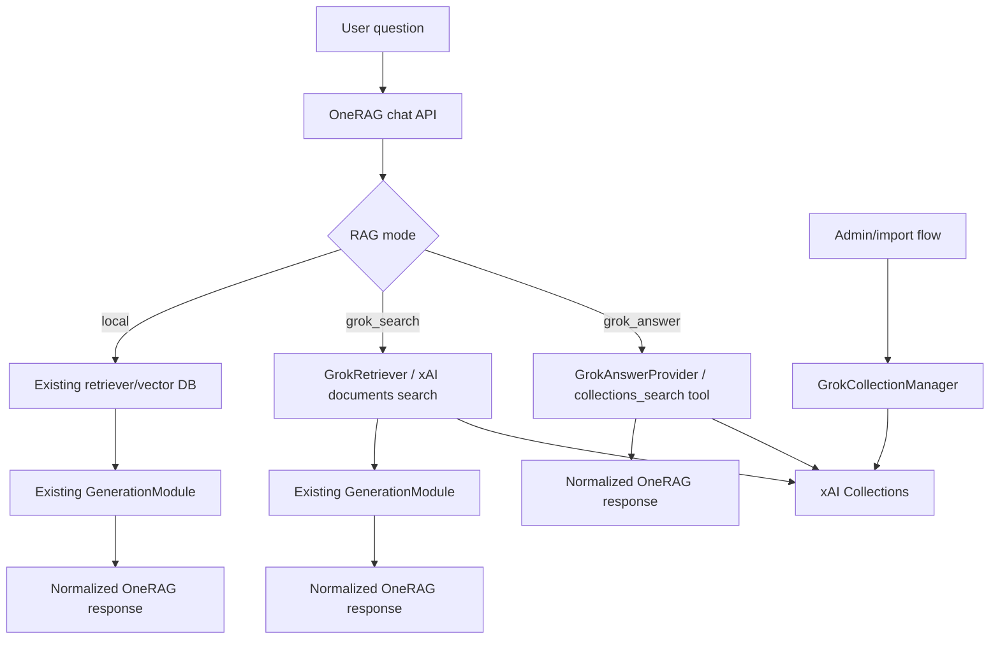

# Grok Managed RAG Goal

Date: 2026-05-06
Status: Phase 1 foundation plus Phase 2 mode hook

## Goal

Provide Grok as a very low-friction RAG option that anyone can verify with an xAI API key and a Collection ID, without forcing Grok into OneRAG's VectorStore abstraction.

The feature must preserve production stability on `main` by treating Grok as a managed RAG provider with explicit modes, bounded credentials, and mockable API boundaries.

## User Value

Users should be able to choose one of two Grok-backed RAG paths:

1. `grok_answer`: Grok searches xAI Collections and generates the final answer.
2. `grok_search`: Grok searches xAI Collections, then OneRAG's configured generation provider produces the final answer.

This gives OneRAG both a quick-start path and a comparison path:

- Quick verification: no local vector DB setup, no embedding pipeline setup.
- Controlled evaluation: compare Grok retrieval with Gemini/OpenAI/Claude/Ollama/OpenRouter generation.
- Safer architecture: xAI Collection management stays outside `VectorStoreFactory`.

## Non-Goals

- Do not register Grok as a VectorStore provider.
- Do not adapt Grok to `IVectorStore.search(query_vector=...)`.
- Do not require xAI Management API keys for read-only chat/search.
- Do not make real xAI network calls in unit tests.

## Target Architecture

## Phase Plan

### Phase 1: Safe Foundation

- Add a Goal document and explicit acceptance criteria.
- Extend Grok config with separate answer, search, and management endpoints.
- Add `GrokCollectionManager` for Collection/file lifecycle operations.
- Add `GrokAnswerProvider` as a separate answer-generation boundary.
- Add mock-based unit tests for API payloads, credential handling, response parsing, and close/health behavior.

### Phase 2: Pipeline Integration

- Add a mode resolver for `local`, `grok_search`, and `grok_answer`.
- Wire `grok_search` through existing retrieval/generation flow.
- Wire `grok_answer` through a narrow fast path that returns the existing chat response shape.
- Add debug trace markers for selected mode, provider, collection IDs count, and citations count.

Current implementation:

- `local` remains the default when Grok is not selected.
- `grok_search` uses the normal retrieval/generation pipeline with `GrokRetriever`.
- `grok_answer` uses `GrokAnswerProvider` as a narrow fast path after routing.
- `options.rag_mode` can explicitly select `local`, `grok_search`, or `grok_answer`.

### Phase 3: Verification Experience

- Add an easy-start guide for xAI Collection setup.
- Add a smoke-test command that validates credentials, collection IDs, and one sample query.
- Add docs that explain when to use `grok_answer` vs. `grok_search`.

## Acceptance Criteria

- `VECTOR_DB_PROVIDER=grok` still means managed retrieval, not VectorStore.
- `XAI_API_KEY` is enough for search/answer modes.
- `XAI_MANAGEMENT_API_KEY` is only required for Collection management.
- Unit tests do not call the real xAI API.
- Existing Grok retriever tests continue to pass unless intentionally migrated with equivalent coverage.
- Existing mainline RAG paths remain unchanged when Grok is not selected.
- API keys are never logged.

## Harness Gates

1. Architecture gate: no Grok registration in `VectorStoreFactory`.
2. Security gate: management key is optional and scoped only to management operations.
3. Test gate: mock tests cover success, auth failure, rate limit, malformed response, and cleanup.
4. Compatibility gate: existing chat request schema can carry mode through `options` before adding public API fields.
5. Release gate: pipeline integration ships only after foundation tests pass.

## References

- xAI Collections API overview: https://docs.x.ai/docs/collections-api
- xAI Search in Collections: https://docs.x.ai/docs/collections-api/search
- xAI Collection management: https://docs.x.ai/docs/collections-api/collection
- xAI Collections Search Tool: https://docs.x.ai/developers/tools/collections-search
- xAI Files upload API: https://docs.x.ai/developers/rest-api-reference/files/upload
